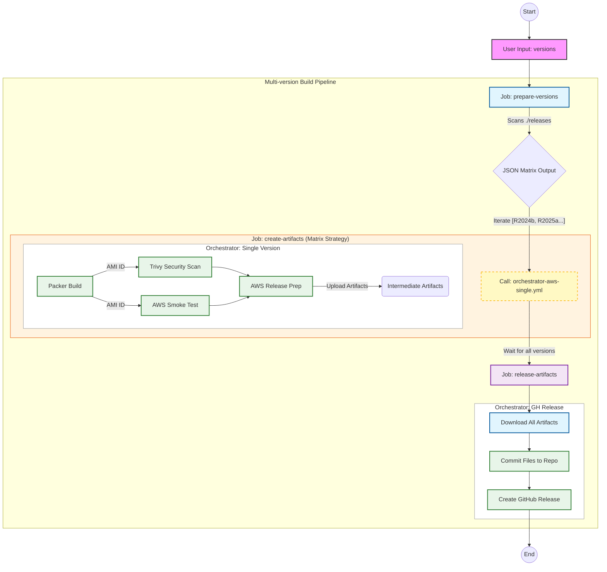

```mermaid
graph TD
    %% Define Styles
    classDef input fill:#f9f,stroke:#333,stroke-width:2px;
    classDef logic fill:#e1f5fe,stroke:#01579b,stroke-width:2px;
    classDef matrix fill:#fff9c4,stroke:#fbc02d,stroke-width:2px,stroke-dasharray: 5 5;
    classDef submodule fill:#e8f5e9,stroke:#2e7d32,stroke-width:2px;
    classDef release fill:#f3e5f5,stroke:#7b1fa2,stroke-width:2px;

    %% Workflow Trigger
    Start((Start)) --> Inputs[User Input: versions]:::input
    Inputs --> Job1

    %% Parent Workflow Scope
    subgraph Parent_Workflow ["Multi-version Build Pipeline"]
        direction TB
        
        Job1[Job: prepare-versions]:::logic
        Job1 -- "Scans ./releases" --> MatrixData{JSON Matrix Output}
        
        %% Job 2: The Matrix Strategy
        MatrixData -- "Iterate [R2024b, R2025a...]" --> Job2
        
        subgraph Matrix_Exec ["Job: create-artifacts (Matrix Strategy)"]
            direction TB
            style Matrix_Exec fill:#fff3e0,stroke:#e65100
            
            Job2[Call: orchestrator-aws-single.yml]:::matrix
            
            %% Detail of the Called Workflow
            subgraph Orch_Single ["Orchestrator: Single Version"]
                style Orch_Single fill:#ffffff,stroke:#999
                
                StepA[Packer Build]:::submodule
                StepB[Trivy Security Scan]:::submodule
                StepC[AWS Smoke Test]:::submodule
                StepD[AWS Release Prep]:::submodule
                
                StepA -- "AMI ID" --> StepB
                StepA -- "AMI ID" --> StepC
                StepB --> StepD
                StepC --> StepD
                
                StepD -- "Upload Artifacts" --> Artifacts(Intermediate Artifacts)
            end
        end

        %% Job 3: Aggregation
        Job2 -- "Wait for all versions" --> Job3
        
        Job3[Job: release-artifacts]:::release
        
        subgraph Orch_Release ["Orchestrator: GH Release"]
            style Orch_Release fill:#ffffff,stroke:#999
            
            StepE[Download All Artifacts]:::logic
            StepF[Commit Files to Repo]:::submodule
            StepG[Create GitHub Release]:::submodule
        end
        
        Job3 --> StepE --> StepF --> StepG
    end

    StepG --> End((End))
```