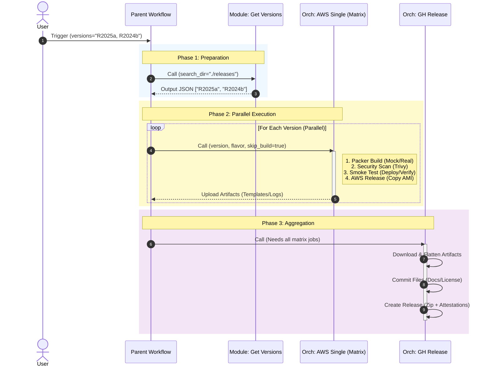

```mermaid
sequenceDiagram
    autonumber
    actor User
    participant Parent as Parent Workflow
    participant VerModule as Module: Get Versions
    participant OrchAWS as Orch: AWS Single (Matrix)
    participant OrchGH as Orch: GH Release

    User->>Parent: Trigger (versions="R2025a, R2024b")
    
    rect rgb(240, 248, 255)
        Note over Parent, VerModule: Phase 1: Preparation
        Parent->>VerModule: Call (search_dir="./releases")
        VerModule-->>Parent: Output JSON ["R2025a", "R2024b"]
    end

    rect rgb(255, 250, 205)
        Note over Parent, OrchAWS: Phase 2: Parallel Execution
        loop For Each Version (Parallel)
            Parent->>OrchAWS: Call (version, flavor, skip_build=true)
            
            activate OrchAWS
            Note right of OrchAWS: 1. Packer Build (Mock/Real)<br/>2. Security Scan (Trivy)<br/>3. Smoke Test (Deploy/Verify)<br/>4. AWS Release (Copy AMI)
            OrchAWS-->>Parent: Upload Artifacts (Templates/Logs)
            deactivate OrchAWS
        end
    end

    rect rgb(243, 229, 245)
        Note over Parent, OrchGH: Phase 3: Aggregation
        Parent->>OrchGH: Call (Needs all matrix jobs)
        activate OrchGH
        OrchGH->>OrchGH: Download & Flatten Artifacts
        OrchGH->>OrchGH: Commit Files (Docs/License)
        OrchGH->>OrchGH: Create Release (Zip + Attestations)
        deactivate OrchGH
    end
```